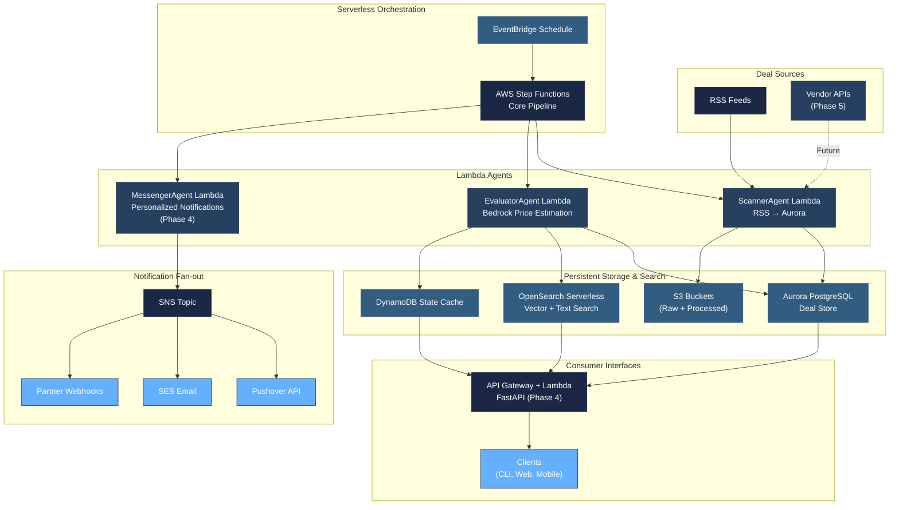

```mermaid
flowchart TD
    classDef primary fill:#1B2845,stroke:#1B2845,color:#ffffff
    classDef secondary fill:#274060,stroke:#274060,color:#ffffff
    classDef accent fill:#335C81,stroke:#335C81,color:#ffffff
    classDef link fill:#65AFFF,stroke:#274060,color:#ffffff

    subgraph Input["Deal Sources"]
        RSS[RSS Feeds]:::primary
        Vendors["Vendor APIs\n(Phase 5)"]:::secondary
    end

    subgraph Orchestration["Serverless Orchestration"]
        EventBridge[EventBridge Schedule]:::accent
        StepFn["AWS Step Functions\nCore Pipeline"]:::primary
    end

    subgraph Agents["Lambda Agents"]
        Scanner["ScannerAgent Lambda\nRSS → Aurora"]:::secondary
        Evaluator["EvaluatorAgent Lambda\nBedrock Price Estimation"]:::secondary
        Messenger["MessengerAgent Lambda\nPersonalized Notifications\n(Phase 4)"]:::secondary
    end

    subgraph Data["Persistent Storage & Search"]
        Aurora["Aurora PostgreSQL\nDeal Store"]:::accent
        OpenSearch["OpenSearch Serverless\nVector + Text Search"]:::accent
        S3Archive["S3 Buckets\n(Raw + Processed)"]:::accent
        DynamoDB["DynamoDB State Cache"]:::accent
    end

    subgraph Notifications["Notification Fan-out"]
        SNS["SNS Topic"]:::primary
        Pushover["Pushover API"]:::link
        Email["SES Email"]:::link
        Webhook["Partner Webhooks"]:::link
    end

    subgraph API["Consumer Interfaces"]
        APIG["API Gateway + Lambda\nFastAPI (Phase 4)"]:::primary
        Clients["Clients\n(CLI, Web, Mobile)"]:::link
    end

    RSS --> Scanner
    Vendors -. Future .-> Scanner
    EventBridge --> StepFn
    StepFn --> Scanner
    StepFn --> Evaluator
    StepFn --> Messenger
    Scanner --> Aurora
    Evaluator --> Aurora
    Evaluator --> OpenSearch
    Evaluator --> DynamoDB
    Scanner --> S3Archive
    Messenger --> SNS
    SNS --> Pushover
    SNS --> Email
    SNS --> Webhook
    APIG --> Clients
    Aurora --> APIG
    OpenSearch --> APIG
    DynamoDB --> APIG
```