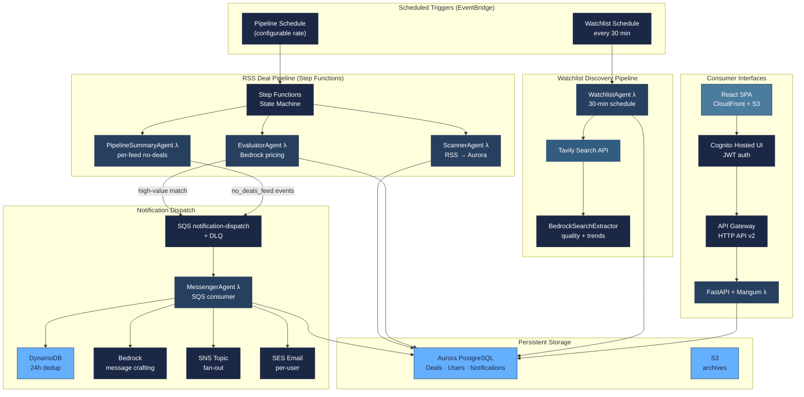
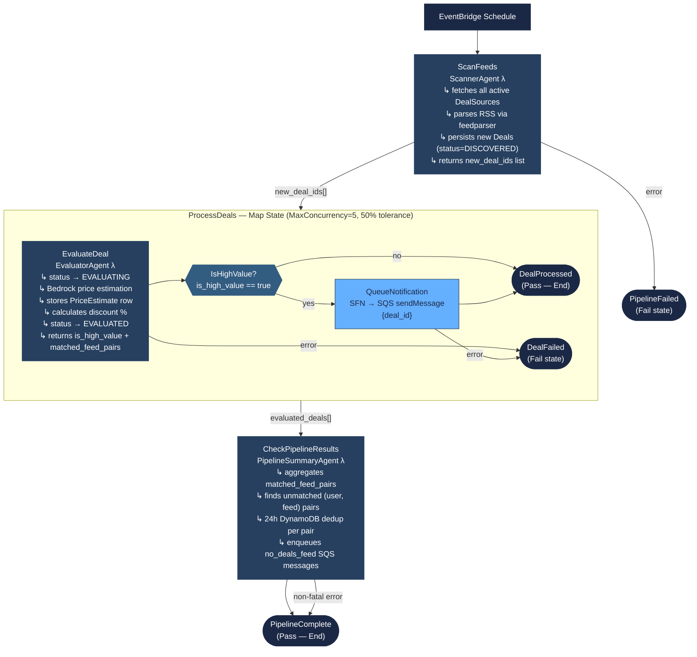
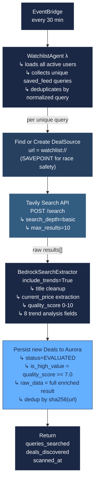
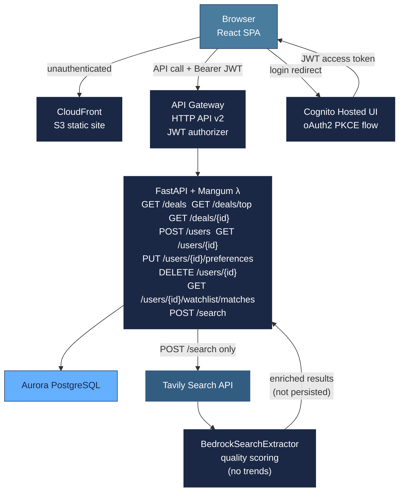

# Deal Finder — Process Flows

**Last Updated:** March 7, 2026
**Status:** Phase 7 deployed and live in production.

This document describes all active data flows in the system. Each section covers one pipeline or subsystem with a flow diagram and a prose walkthrough.

---

## 1. System Architecture Overview

---

## 2. RSS Deal Pipeline (Step Functions)

Triggered by EventBridge on a configurable schedule (default every 15 minutes, currently disabled in production pending Aurora enablement). The Step Functions state machine coordinates four Lambdas.

### Step-by-step walkthrough

**ScanFeeds (ScannerAgent)**
- Reads all `DealSource` rows with `is_active=true` from Aurora.
- Fetches each RSS feed via `feedparser` (run in executor thread, 30s socket timeout).
- For each new entry: creates a `Deal` row with `status=DISCOVERED` and raw metadata in `raw_data` JSONB. Skips duplicates matched by `(source_id, external_id)`. Uses `begin_nested()` SAVEPOINTs to safely handle concurrent duplicate inserts.
- Updates `last_checked_at` and `error_count` on the source regardless of success.
- Returns `{new_deal_ids, sources_scanned, deals_discovered, scanned_at}`.

**ProcessDeals — Map State**
- Fans out over `new_deal_ids` in parallel (max 5 concurrent), 50% failure tolerance.

**EvaluateDeal (EvaluatorAgent)**
- Sets `status=EVALUATING`.
- Calls `BedrockPriceEstimator.estimate_price()` with title, sale price, description, brand.
- Stores a `PriceEstimate` row with model ID, confidence, price range, inference time.
- Calculates `discount_percentage = (estimated − sale) / estimated × 100`.
- If `discount >= threshold` (default 20%): calls `mark_as_high_value()`, sets `is_high_value=true`.
- Sets `status=EVALUATED`.
- Scans all users' `saved_feeds` for keyword matches; if any match, enqueues `{deal_id}` to SQS `notification-dispatch`. Returns `matched_feed_pairs` list.
- Transient Bedrock errors (`ThrottlingException` etc.) reset status to `DISCOVERED` and re-raise, allowing Step Functions retry.

**QueueNotification**
- Step Functions SDK integration: `arn:aws:states:::sqs:sendMessage` sends `{"deal_id": "<uuid>"}` to the `notification-dispatch` SQS queue directly (no Lambda invocation).

**CheckPipelineResults (PipelineSummaryAgent)**
- Aggregates all `matched_feed_pairs` from the evaluated_deals array.
- Loads all active users from Aurora, checks each user's `saved_feeds`.
- For each `(user_id, feed_id)` pair not in the matched set: checks a rolling 24h DynamoDB dedup key (`no-deals-feed#<user_id>#<feed_id>`). If absent, enqueues a `no_deals_feed` SQS message.
- Non-fatal: if this Lambda errors, the pipeline still transitions to `PipelineComplete`.

---

## 3. WatchlistAgent Flow (Scheduled Discovery)

Runs on a separate 30-minute EventBridge schedule, independently of the RSS pipeline. Proactively discovers deals from users' saved watchlist queries via Tavily + Bedrock, without needing an RSS feed.

### Notes
- Each unique query maps to a `DealSource` with `url=watchlist://<query>`. This keeps watchlist deals separate from RSS deals in the DB while reusing the same `Deal` table.
- The `watchlist/matches` API endpoint picks these up via ILIKE keyword matching on `deal.title` — no schema changes needed.
- Trend fields (`trend`, `trend_confidence`, `price_trend`, `discount_frequency`, `stockouts_last_30_days`, `review_velocity`, `competitor_activity`, `trend_summary`) are stored in `raw_data` JSONB and surfaced through the `GET /users/{id}/watchlist/matches` response.
- If Bedrock enrichment fails, the agent falls back to raw Tavily title/URL with null quality scores and still persists deals.

---

## 4. Notification Dispatch Flow (MessengerAgent)

The MessengerAgent is an SQS consumer Lambda (event source mapping on the `notification-dispatch` queue). It handles three distinct message types.

```mermaid
flowchart TD
    classDef aws fill:#1B2845,stroke:#1B2845,color:#ffffff
    classDef decision fill:#274060,stroke:#274060,color:#ffffff
    classDef channel fill:#335C81,stroke:#335C81,color:#ffffff
    classDef storage fill:#65AFFF,stroke:#274060,color:#1B2845
    classDef error fill:#8B1A1A,stroke:#8B1A1A,color:#ffffff

    SQS["SQS notification-dispatch\nbatch of records"]:::aws

    SQS --> ParseRecord

    ParseRecord{{"Parse record body\nevent_type?"}}:::decision

    ParseRecord -->|"deal_id present"| DealFlow
    ParseRecord -->|"no_deals_feed"| FeedFlow
    ParseRecord -->|"no_deals"| GlobalFlow
    ParseRecord -->|"malformed JSON"| BIF

    subgraph DealFlow["Deal Notification Flow"]
        Dedup{{"DynamoDB dedup check\nnotif-dedup#deal_id\n24h TTL conditional put"}}:::storage
        Dedup -->|"duplicate"| Skip(["Skip"]):::decision
        Dedup -->|"first seen"| FetchDeal
        FetchDeal["Fetch Deal from Aurora"]:::aws
        FetchDeal --> Craft
        Craft["Bedrock message crafting\nClaude → {title, message}\nfallback: generic template"]:::aws
        Craft --> Dispatch
        Dispatch["Dispatch\n↳ SNS publish (broadcast)\n  + Notification row\n↳ SES per-user (email pref)\n  + Notification row per user"]:::channel
        Dispatch -->|"any channel succeeded"| MarkNotified
        MarkNotified["Deal status → NOTIFIED\nWrite DynamoDB dedup key"]:::storage
        Dispatch -->|"all channels failed"| Raise
        Raise["Raise RuntimeError\n→ SQS retries record"]:::error
    end

    subgraph FeedFlow["Per-Feed No-Deals Flow"]
        FF1["Load user from Aurora\ncheck email pref"]:::aws
        FF1 -->|"email enabled"| FF2
        FF1 -->|"no email / not found"| Skip2(["Skip silently"]):::decision
        FF2["SES send_email\n'No Deals Found — feed_name'\n'Still searching!'"]:::channel
    end

    subgraph GlobalFlow["Global No-Deals Flow"]
        GF1["SNS publish\n'No Deals Found'"]:::channel
        GF1 --> GF2
        GF2["SES per-user\n(email pref enabled only)"]:::channel
    end

    BIF["batchItemFailures"]:::error

    ParseRecord -->|"error in any flow"| BIF
```

### Notes
- **Batch processing:** Returns `{"batchItemFailures": [...]}`. Only failed records are retried; successful records are not.
- **DynamoDB dedup (deal notifications):** Conditional `put_item` with `attribute_not_exists(pk)` — atomic check-and-set. Fails open so a DynamoDB outage does not block notifications.
- **DynamoDB dedup (no_deals_feed):** Managed by `PipelineSummaryAgent` before the message is enqueued. The Messenger does not re-check dedup for these messages.
- **`no_deals_feed` vs `no_deals`:** `no_deals_feed` is per-user, per-feed, SES only (no Bedrock call, no DB row). `no_deals` is a global broadcast via SNS + SES.
- **SNS fan-out:** A single publish reaches all topic subscribers (SMS, email-json). Per-user SES is a separate dispatch in addition to SNS.

---

## 5. API & Search Flow

The React SPA is served from CloudFront (S3 static site). All API calls go through API Gateway → FastAPI/Mangum Lambda → Aurora PostgreSQL.

### Endpoint reference

| Method | Path | Auth | Description |
|--------|------|------|-------------|
| GET | `/api/v1/health` | None | Lambda health check |
| GET | `/deals` | JWT | Paginated deal list, optional status filter |
| GET | `/deals/top` | JWT | High-value deals sorted by discount % |
| GET | `/deals/{id}` | JWT | Single deal detail |
| POST | `/users` | None | Create user account |
| GET | `/users/{id}` | JWT (own) | Profile + preferences; auto-provisions Cognito user |
| PUT | `/users/{id}/preferences` | JWT (own) | Update notification prefs + saved feeds |
| DELETE | `/users/{id}` | JWT (own) | Soft-deactivate account |
| GET | `/users/{id}/watchlist/matches` | JWT (own) | Deals matching saved feeds (incl. trend fields) |
| POST | `/search` | JWT | Tavily + Bedrock on-demand search (not persisted) |

### Key behaviours
- **Cognito auto-provisioning:** User-scoped endpoints call `_get_or_provision_user()`. If no DB record exists for the Cognito `sub` UUID, one is created on the fly using the token `username` claim (sign-in email).
- **`POST /search` is transient:** Results are not persisted to Aurora. Users save selected items as `saved_feeds` via `PUT /users/{id}/preferences`.
- **Watchlist matches include trend fields:** The `GET /users/{id}/watchlist/matches` response includes all 8 trend analysis fields from `raw_data` JSONB for WatchlistAgent-sourced deals.
- **Phone → SNS subscription:** `PUT /users/{id}/preferences` with a `phone_number` triggers a best-effort SNS SMS subscription.

---

## 6. Data Store Roles

| Store | Purpose | Written by | Read by |
|-------|---------|-----------|--------|
| Aurora — `deals` | All discovered/evaluated deals | ScannerAgent, EvaluatorAgent, WatchlistAgent | EvaluatorAgent, MessengerAgent, API Lambda |
| Aurora — `deal_sources` | RSS and `watchlist://` sources | ScannerAgent, WatchlistAgent | ScannerAgent, WatchlistAgent, API Lambda |
| Aurora — `users` | User accounts, preferences, saved_feeds | API Lambda | EvaluatorAgent, PipelineSummaryAgent, MessengerAgent, API Lambda |
| Aurora — `price_estimates` | Bedrock pricing results | EvaluatorAgent | API Lambda |
| Aurora — `notifications` | Dispatch audit log | MessengerAgent | API Lambda |
| DynamoDB — pipeline-dedup | 24h dedup keys | MessengerAgent (deal notif), PipelineSummaryAgent (no_deals_feed) | MessengerAgent, PipelineSummaryAgent |
| S3 | Raw + processed deal archives | ScannerAgent (planned) | Offline analytics |
| SQS — notification-dispatch | Deal IDs + no_deals_feed/no_deals events | EvaluatorAgent, PipelineSummaryAgent, Step Functions | MessengerAgent (ESM) |
| SNS — deal-notifications | Fan-out to all subscribers | MessengerAgent | SMS + email subscribers |

---

## 7. Error Handling & Retry Summary

| Component | Retry mechanism | Failure outcome |
|-----------|----------------|----------------|
| ScannerAgent | Step Functions retry (3×, 2s backoff) | `PipelineFailed` Fail state → `ExecutionsFailed` alarm |
| EvaluatorAgent | Step Functions retry (2×, 2s backoff) | `DealFailed` Fail state; counted against 50% Map tolerance |
| Bedrock transient errors | Re-raises `ClientError` → Step Functions retries | After max retries → `DealFailed` |
| QueueNotification (SFN→SQS) | Step Functions retry (3×) | `DealFailed` |
| PipelineSummaryAgent | Step Functions catch → `PipelineComplete` | Non-fatal; pipeline still completes |
| MessengerAgent | SQS `batchItemFailures` → SQS retry | DLQ after max receive count; DLQ depth alarm fires |
| WatchlistAgent | None (EventBridge direct invoke) | Silent; next run in 30 min |
| Bedrock enrichment (WatchlistAgent) | Fallback to raw Tavily results | Deals persisted without quality score or trends |
| API Lambda | API Gateway 30s timeout | 504 to client |
