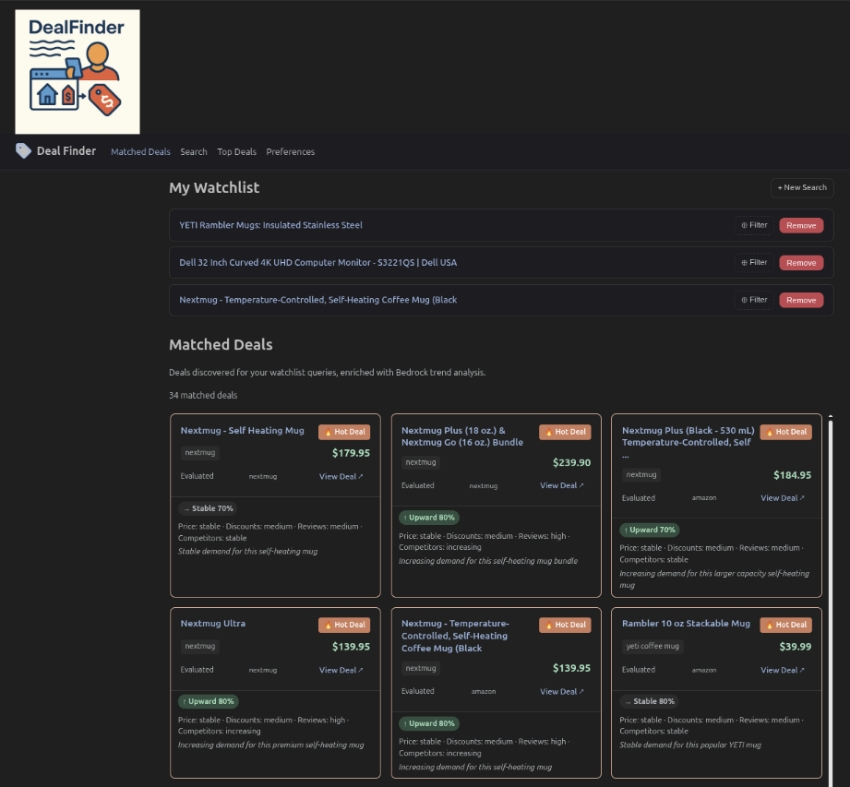

# Deal Finder

[](https://www.python.org/downloads/release/python-3120/)
[](https://react.dev/)
[](https://www.typescriptlang.org/)
[](https://aws.amazon.com/)
[](https://www.terraform.io/)
[](https://fastapi.tiangolo.com/)
[](LICENSE)
[](https://github.com/Bytes0211/dealfinder/actions/workflows/backend.yml)
[](https://github.com/Bytes0211/dealfinder/actions/workflows/frontend.yml)

> AI-Powered Deal Hunting Autonomous Agent System

An intelligent multi-agent system that discovers online deals through RSS feeds, estimates prices using AWS Bedrock (Claude), and delivers real-time notifications for high-value opportunities. Built serverless on AWS by a solo developer.

## Dealfinder in action - matched deals with real-time trend analysis




## Project Status

**Current Phase:** Phase 7 Complete — WatchlistAgent + React Frontend Live in Production

**Scope:** 7 phases | Serverless-first | Target cost: $200-500/month

See [developer/project-status.md](developer/project-status.md) for detailed tracking.

## Architecture

```
RSS Feeds → Lambda (Scanner) → Step Functions → Lambda (Evaluator) → SNS → SMS/Email
                                                      ↕
                                                Aurora + OpenSearch
                                                      ↕
                                                Bedrock (Claude)

Tavily → Lambda (WatchlistAgent, scheduled 30min) → Bedrock → Aurora

React SPA (CloudFront) → API Gateway → Lambda (FastAPI/Mangum) → Aurora
```

### Agent Architecture
- **ScannerAgent**: Scrapes RSS feeds for deals (Lambda)
- **EvaluatorAgent**: Estimates prices via Bedrock, calculates discounts, returns `matched_feed_pairs` (Lambda)
- **PipelineSummaryAgent**: Aggregates per-feed match results, enqueues per-feed no-deals notifications with 24h dedup (Lambda)
- **MessengerAgent**: Generates personalized notifications using Claude, dispatches via SNS/SES; handles both deal alerts and `no_deals_feed` events (Lambda)
- **WatchlistAgent**: Scheduled (30-min EventBridge) proactive deal discovery via Tavily + Bedrock trend enrichment (Lambda)


---

### AI Model Configuration

Bedrock models are configured centrally in `config/bedrock_models.json`. To swap or upgrade a model, edit this file — no code changes required.

```json
{
  "_comment": "Central Bedrock model configuration. Update model IDs here when AWS deprecates or you upgrade models.",
  "default": "anthropic.claude-3-haiku-20240307-v1:0",
  "estimator": "anthropic.claude-3-haiku-20240307-v1:0",
  "messenger": "anthropic.claude-3-haiku-20240307-v1:0",
  "search_extractor": "anthropic.claude-3-haiku-20240307-v1:0",
  "watchlist": "anthropic.claude-3-haiku-20240307-v1:0"
}
```

| Key | Used By |
|-----|---------|
| `default` | Fallback if a specific key is not matched |
| `estimator` | EvaluatorAgent — price estimation via Bedrock |
| `messenger` | MessengerAgent — notification crafting via Bedrock |
| `search_extractor` | WatchlistAgent search — `BedrockSearchExtractor` |
| `watchlist` | WatchlistAgent — trend enrichment via Bedrock |

To upgrade a model, update the relevant key and redeploy the affected Lambda. All agents read from this file at startup.

---

### Orchestration
AWS Step Functions coordinates the pipeline:
```
EventBridge (schedule) → Scanner → Evaluate → Decide (discount > threshold?) → Notify → Update State
```

### Data Flow
- **Messaging:** SQS queues with dead letter queues for reliability, SNS for fan-out notifications
- **Storage:** Aurora PostgreSQL (relational), OpenSearch (vector DB with k-NN), DynamoDB (state/cache with TTL), S3 (archives)
- **LLM:** AWS Bedrock (Claude) for price estimation and notification crafting

## Technology Stack

### Backend
- **Language:** Python 3.12
- **API Framework:** FastAPI + Mangum (Lambda adapter)
- **Compute:** AWS Lambda + Step Functions
- **Package Manager:** uv

### Frontend
- **Framework:** React 19 + Vite + TypeScript
- **Auth:** AWS Cognito Hosted UI
- **Hosting:** S3 + CloudFront

### Data Layer
- **Relational DB:** AWS Aurora PostgreSQL Serverless v2
- **Vector Database:** AWS OpenSearch with k-NN plugin
- **NoSQL/Cache:** AWS DynamoDB (with TTL)
- **Object Storage:** AWS S3
- **Messaging:** SQS (queues + DLQ), SNS (fan-out)

### AI
- **LLM:** AWS Bedrock (Claude 3 Haiku) for price estimation, notification crafting, and deal trend enrichment
- **Search:** Tavily API for proactive watchlist deal discovery

### Infrastructure
- **IaC:** Terraform (remote state in S3 + DynamoDB locking)
- **Monitoring:** CloudWatch (logs, alarms, dashboard, cost anomaly detection)
- **Secrets:** AWS Secrets Manager

## Repository Structure

```
dealfinder/
├── AGENTS.md                      # AI agent guidance
├── PRODUCTION_PLAN.md             # System architecture and phase plan
├── PROCESS_FLOWS.md               # Visual workflow diagrams
├── TECHNOLOGY_RATIONALE.md        # Technology selection reasoning
├── developer/
│   ├── developer_journal.md       # Development session logs
│   └── project-status.md          # Project timeline and status
├── frontend/                      # React 19 + Vite + TypeScript SPA
│   ├── src/
│   │   ├── api/                   # axios client + typed API wrappers
│   │   ├── auth/                  # Cognito Hosted UI helpers + JWT decode
│   │   ├── components/            # NavBar, DealCard, Pagination, ProtectedRoute
│   │   ├── hooks/                 # TanStack Query hooks
│   │   └── pages/                 # FeedPage, SearchPage, TopDealsPage, PreferencesPage
│   └── dist/                      # Vite build output (deployed to S3/CloudFront)
├── infrastructure/                # Terraform IaC
│   ├── bootstrap.sh               # Backend setup script (one-time)
│   ├── environments/dev/          # Dev environment (deployed)
│   └── modules/
│       ├── networking/            # VPC, subnets, VPC endpoints
│       ├── data/                  # S3, DynamoDB, Aurora, OpenSearch
│       ├── monitoring/            # CloudWatch logs, alarms, dashboard
│       ├── pipeline/              # SQS, Lambda, Step Functions, EventBridge
│       ├── notifications/         # SNS, Messenger Lambda, IAM
│       ├── api/                   # API Lambda, API Gateway, Cognito
│       └── frontend/              # S3 + CloudFront static site, OAC
├── src/dealfinder/                # Python package
│   ├── agents/
│   │   ├── config.py              # AgentConfig (pydantic-settings)
│   │   ├── bedrock.py             # BedrockPriceEstimator, BedrockSearchExtractor
│   │   ├── scanner.py             # ScannerAgent Lambda + handler()
│   │   ├── evaluator.py           # EvaluatorAgent Lambda + handler()
│   │   ├── pipeline_summary.py    # PipelineSummaryAgent Lambda + handler()
│   │   ├── messenger.py           # MessengerAgent Lambda + handler()
│   │   └── watchlist.py           # WatchlistAgent Lambda + handler() (Phase 7)
│   ├── notifications/
│   │   └── ses.py                 # SesClient (boto3 SES v2)
│   ├── api/                       # FastAPI REST API
│   │   ├── main.py                # FastAPI app + Mangum handler
│   │   ├── schemas.py             # Pydantic request/response models
│   │   ├── deps.py                # DB session + Cognito auth dependencies
│   │   └── routes/
│   │       ├── health.py          # GET /api/v1/health
│   │       ├── deals.py           # GET /api/v1/deals, /top, /{id}
│   │       ├── users.py           # POST /api/v1/users, preferences, watchlist
│   │       └── search.py          # POST /api/v1/search — Tavily + Bedrock
│   ├── db/
│   │   ├── models.py              # SQLAlchemy ORM models (5 models, 3 enums)
│   │   ├── connection.py          # Async engine and session management
│   │   └── alembic/               # Database migrations (008 applied)
│   ├── data/
│   │   └── repository.py          # Repository pattern (5 repository classes)
│   └── search/
│       ├── client.py              # OpenSearch client (k-NN, bulk, CRUD)
│       ├── embeddings.py          # Embedding service (abstract provider pattern)
│       └── index.py               # Index management and mappings
├── tests/
│   ├── unit/
│   │   ├── agents/                # Agent unit tests
│   │   ├── notifications/         # SesClient tests
│   │   ├── api/                   # FastAPI endpoint tests
│   │   ├── db/                    # ORM model tests
│   │   ├── data/                  # Repository tests
│   │   └── search/                # OpenSearch/embedding tests
│   └── infrastructure/            # AWS resource validation tests
└── pyproject.toml                 # Dependencies, tool config, build settings
```

## Getting Started

### Prerequisites

- AWS Account with programmatic access
- Terraform 1.14+
- Python 3.12+
- uv package manager

### Development Setup

```bash
# Clone repository
git clone https://github.com/Bytes0211/dealfinder.git
cd dealfinder

# Install dependencies (including dev tools)
uv sync --all-extras --dev

# Bootstrap Terraform backend (one-time)
cd infrastructure
./bootstrap.sh us-east-1 dev

# Deploy infrastructure
cd environments/dev
cp terraform.tfvars.example terraform.tfvars
# Edit terraform.tfvars with your settings
terraform init
terraform plan
terraform apply
```

### Running Tests

```bash
# Run all tests
uv run pytest tests/ -v

# Run unit tests only
uv run pytest tests/unit/ -v

# Run infrastructure validation tests
uv run pytest tests/infrastructure/ -v

# Run with coverage
uv run pytest tests/ --cov=src --cov-report=html
```

## Performance Targets

- **Pipeline reliability:** >95% successful executions
- **API latency:** <1s P95
- **Notification delivery:** <2 minutes from discovery
- **Monthly cost:** <$500

## Cost Management

Feature flags keep idle dev costs at ~$4-10/month:

- `enable_nat_gateway`: false (saves ~$100/month)
- `enable_aurora`: false (saves $50-100/month)
- `enable_opensearch`: false (saves $25-75/month)

**Production target:** $200-500/month

## Roadmap

### Phase 1: Infrastructure Setup — COMPLETE
- Terraform backend, VPC, networking, S3, DynamoDB
- CloudWatch monitoring (logs, alarms, dashboard, cost anomaly)

### Phase 2: Data Layer — COMPLETE
- SQLAlchemy ORM models and Alembic migrations
- Repository pattern data access layer
- OpenSearch client with vector search
- Embedding service with provider abstraction

### Phase 3: Core Pipeline — COMPLETE
- ScannerAgent Lambda (RSS parsing, SHA-256 dedup, async feedparser)
- BedrockPriceEstimator (Claude via boto3, async via run_in_executor)
- EvaluatorAgent Lambda (discount calc, high-value flagging)
- Step Functions state machine (Scan → Map(Evaluate → IsHighValue?) → Notify)
- SQS queues + DLQ alarms + EventBridge schedule

### Phase 4: Notifications + API — COMPLETE
- MessengerAgent Lambda (SQS batch, DynamoDB dedup, Bedrock message crafting)
- SesClient with full error handling
- SNS topic for deal-notifications fan-out
- FastAPI REST API + Mangum adapter
- API Gateway HTTP API v2 + Cognito JWT authorizer
- Terraform modules: `notifications/` + `api/`

### Phase 5: Per-Feed Notifications — COMPLETE
- PipelineSummaryAgent Lambda (per-feed no-deals 24h dedup)
- MessengerAgent `notify_no_deals_feed` via SES
- EvaluatorAgent returns `matched_feed_pairs`

### Phase 6: React Frontend — COMPLETE
- React 19 + Vite + TypeScript SPA
- Cognito Hosted UI authentication
- CloudFront + S3 static hosting (Terraform `frontend/` module)
- Pages: Matched Deals, Search, Top Deals, Preferences

### Phase 7: WatchlistAgent + Production Fixes — COMPLETE
- WatchlistAgent Lambda: Tavily search + Bedrock trend enrichment (30-min schedule)
- `BedrockSearchExtractor` with `include_trends` flag (8 trend fields)
- Migration 006: deactivate legacy product-URL deal sources
- Fixed SQLEnum `values_callable` bug (uppercase name vs lowercase value)
- Updated Bedrock model to `anthropic.claude-3-haiku-20240307-v1:0`
- Dual-ARN Bedrock IAM policy (foundation-model + inference-profile)
- Frontend: watchlist feed filter, scrollable deal grid, consistent page spacing
- Deal cards: `in_stock` badge, trend analysis panel, sale prices, short domain labels
- Hot deal cards: orange outline border (CSS `outline` for dark mode resilience)
- API Lambda granted `bedrock:InvokeModel` IAM; search route aligned with watchlist agent
- Fixed `.env.production` Cognito/API Gateway URLs; restored Cognito callback URLs

## Documentation

- **[PRODUCTION_PLAN.md](PRODUCTION_PLAN.md)** — System design and migration phases
- **[PROCESS_FLOWS.md](PROCESS_FLOWS.md)** — Visual data flow diagrams
- **[TECHNOLOGY_RATIONALE.md](TECHNOLOGY_RATIONALE.md)** — Technology choice reasoning
- **[developer/project-status.md](developer/project-status.md)** — Progress tracking
- **[AGENTS.md](AGENTS.md)** — AI agent context for this repository
- **[infrastructure/TERRAFORM_GUIDE.md](infrastructure/TERRAFORM_GUIDE.md)** — Terraform best practices

## Not in Scope (Intentionally Removed)

The following were removed during the Feb 2026 scope revision to keep the project realistic for a solo developer. See PRODUCTION_PLAN.md "Future Enhancements" for triggers to re-add.

- Kafka/MSK, Spark/EMR, ECS Fargate, SageMaker
- Apache APISIX
- Prometheus/Grafana, ElastiCache

## Security

- **Authorization:** IAM roles for service-to-service
- **Secrets:** AWS Secrets Manager (never hardcoded)
- **Network:** Private VPC subnets for backend services
- **Encryption:** KMS at rest, TLS in transit

## Contact

- Name: Steven Cotton
- Email: stevenwcotton@gmail.com

## License

This project is licensed under the MIT License — see the [LICENSE](LICENSE) file for details.

---

**Built with** AWS Lambda · Step Functions · Bedrock · Aurora · OpenSearch · Terraform · React · CloudFront
