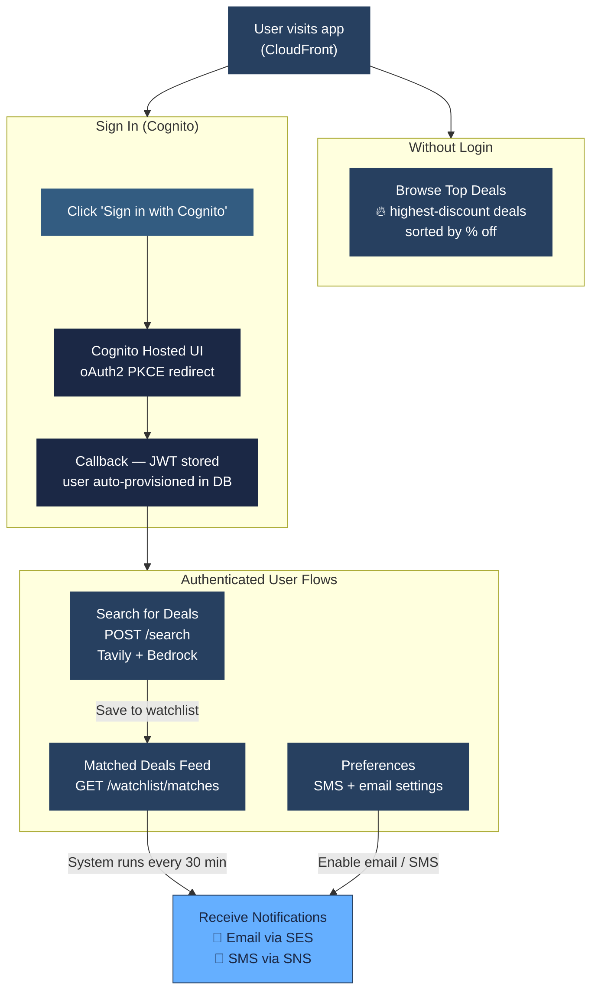
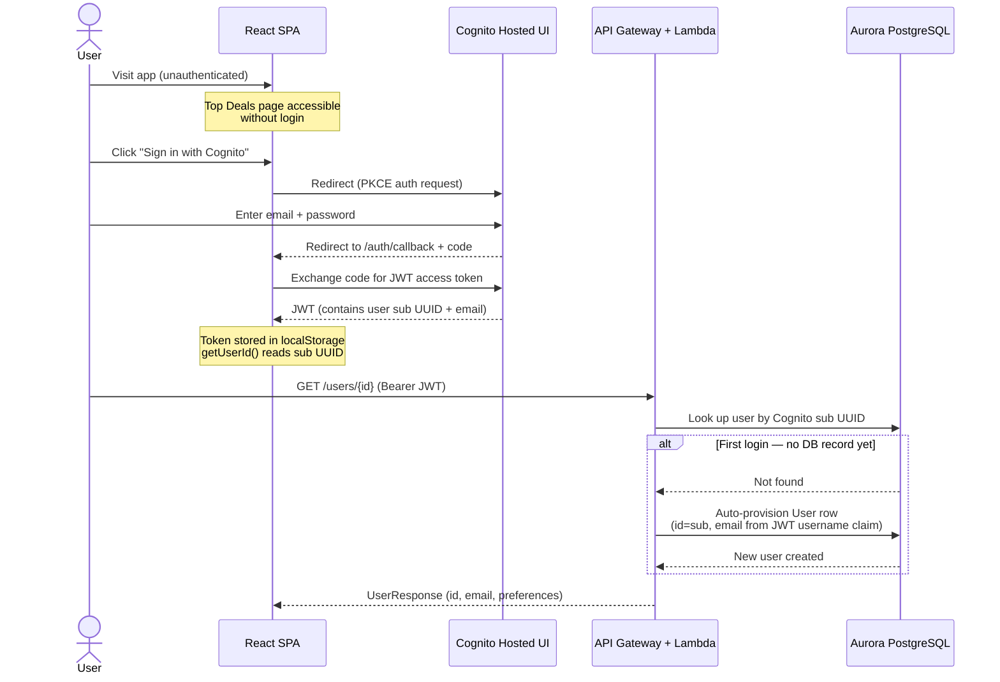
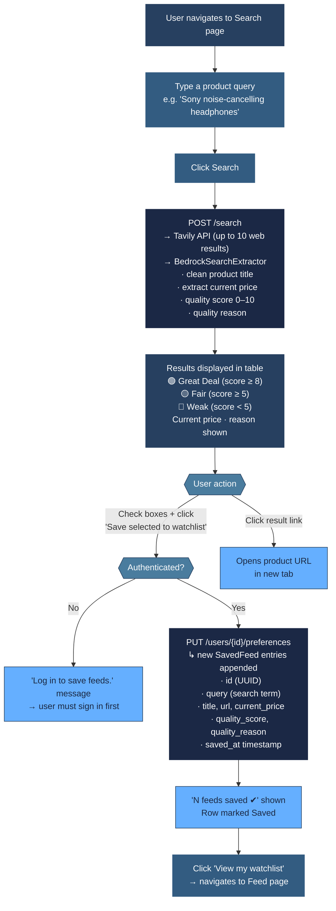
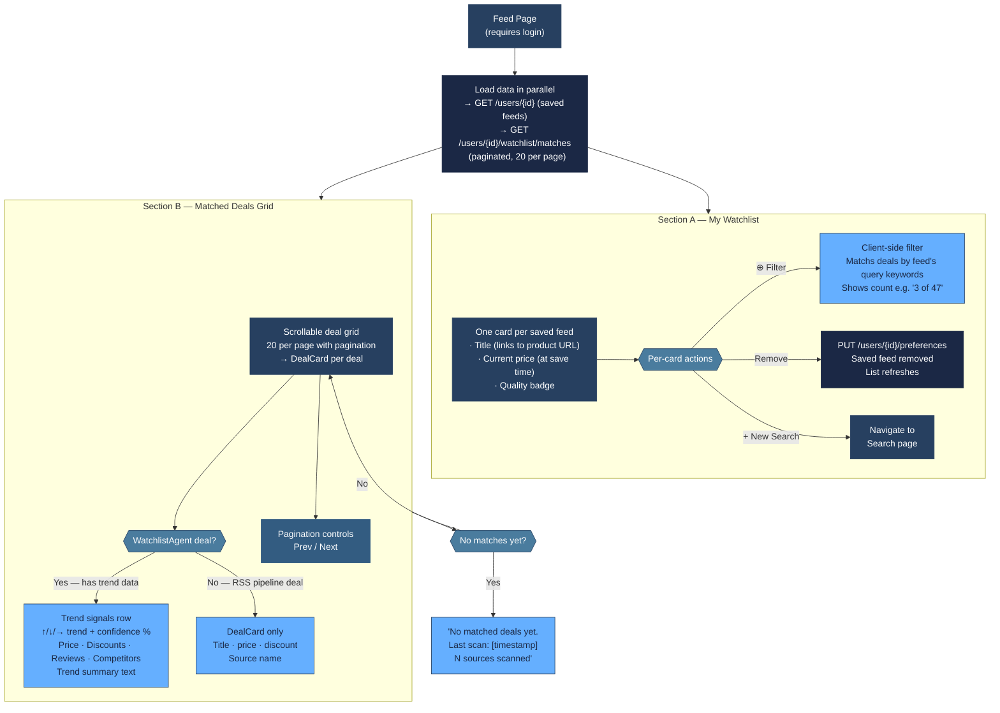
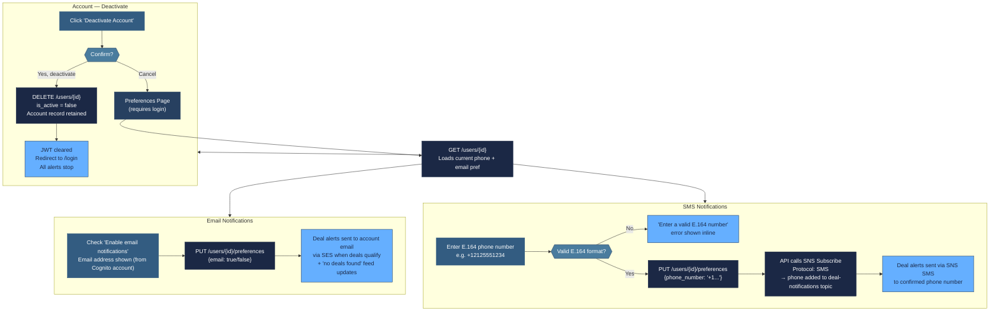
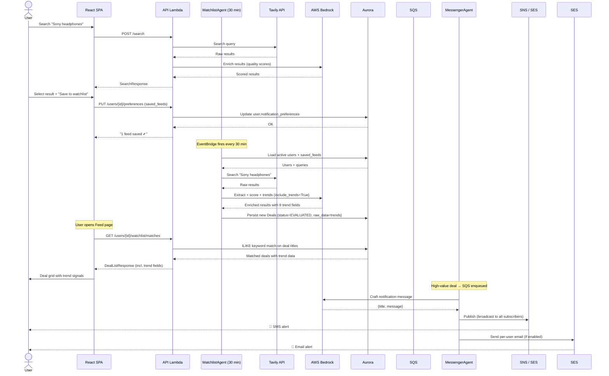

# Deal Finder — User Process Flows

**Last Updated:** March 7, 2026

This document describes the complete user journey through the Deal Finder application — from first visit through deal discovery, watchlist management, notification setup, and receiving alerts.

---

## 1. User Journey Overview

---

## 2. Authentication Flow

The app uses Cognito Hosted UI with an oAuth2 PKCE flow. No passwords are stored in the application database — all authentication is delegated to Cognito.

**Key points:**
- Unauthenticated users can browse the **Top Deals** page without signing in.
- On first login, the API auto-provisions a `User` row using the Cognito `sub` UUID as the primary key and the sign-in email from the JWT `username` claim.
- Subsequent logins reuse the existing DB record — no duplicate provisioning.
- Logging out clears the JWT from localStorage. The Cognito session is separately managed.

---

## 3. Searching for Deals

The Search page lets users find products using natural language. Results are enriched by Bedrock (Claude) in real time and are **not persisted** — they are transient until the user explicitly saves them to their watchlist.

---

## 4. Watchlist & Matched Deals Flow

The Feed page (named "Matched Deals") is the user's home base. It shows their saved watchlist entries and all deals the system has discovered that match those entries.

### What populates the Matched Deals grid

Deals arrive from two sources, both visible in the same grid:

| Source | How it gets there | Has trend data? |
|--------|------------------|-----------------|
| **RSS Pipeline** | Scanner finds deal in RSS feed → Evaluator prices it → `is_high_value=true` → notified via SQS | No |
| **WatchlistAgent** | Every 30 min: Tavily search per watchlist query → Bedrock enrichment → persisted as `EVALUATED` deal | Yes — 8 trend fields |

The `last_scan_at` and `sources_scanned` values shown in the "no matches" state come from the most recent `DealSource.last_checked_at` across all active sources.

---

## 5. Notification Setup Flow

Users configure how they receive deal alerts on the Preferences page. Both channels can be enabled simultaneously.

**Notification channel summary:**

| Channel | Setup required | Delivery trigger | Dedup |
|---------|---------------|-----------------|-------|
| Email (SES) | Enable toggle on Preferences page | High-value deal OR no-deals-feed update | 24h per deal |
| SMS (SNS) | Enter E.164 phone number | High-value deal broadcast to SNS topic | 24h per deal |

---

## 6. End-to-End: From Saved Feed to Notification

This sequence shows the complete path from a user saving a watchlist item to receiving a deal notification.

---

## 7. Page Reference

| Page | URL | Auth required | Purpose |
|------|-----|---------------|---------|
| Login | `/login` | No | Sign in via Cognito Hosted UI |
| Top Deals | `/top` | No | Browse high-value deals sorted by discount |
| Search | `/search` | No (save requires login) | Search + score deals, save to watchlist |
| Feed (Matched Deals) | `/` | Yes | View watchlist + matched deals with trend data |
| Preferences | `/preferences` | Yes | Enable email/SMS notifications, deactivate account |
| Deal Detail | `/deals/:id` | No | Single deal detail view |

### What unauthenticated users can do
- Browse **Top Deals** (RSS pipeline high-value deals, sorted by discount %)
- Run searches on the **Search** page and view quality scores
- Open any product URL directly from search results

### What requires login
- Saving search results to a watchlist
- Viewing the personalized **Matched Deals** feed
- Configuring email or SMS notification preferences
- Removing items from the watchlist
